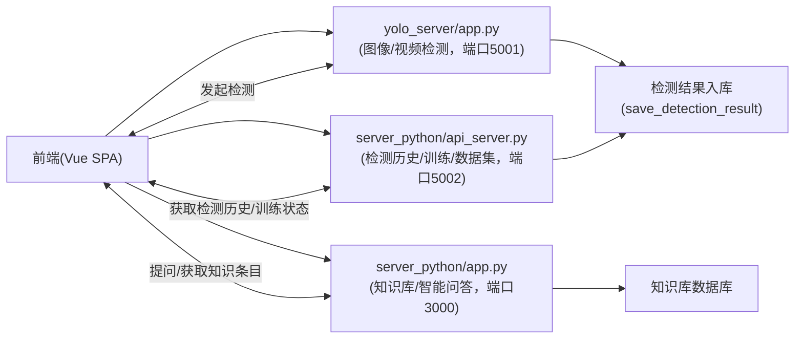
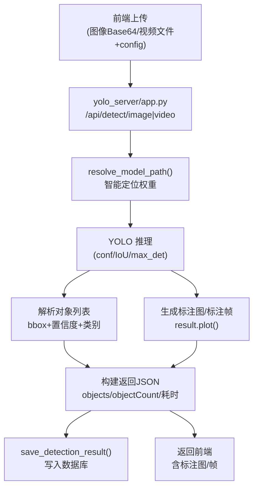
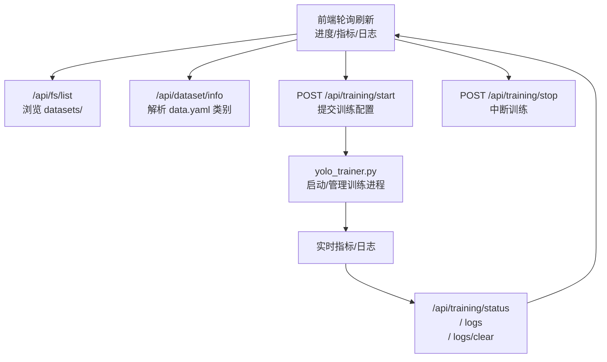

# 基于 YOLOv8 的通用智能识别系统 — 功能简介

## 一、系统整体定位

本项目是一个围绕 YOLOv8 构建的「通用视觉智能检测平台」，集成了图像/视频目标检测、检测结果历史管理、知识库管理、智能问答以及模型训练等能力，前后端完全分离，适合作为实际业务落地示例或教学/二次开发的基础工程。

整体架构主要包含：

- 前端应用：基于 Vue 2 的单页应用（`src`），负责界面交互、业务流程编排和可视化展示。
- 检测服务：基于 Ultralytics YOLO 的 Flask 服务（`yolo_server/app.py`，默认端口 5001），提供图像/视频检测 API，并将检测结果持久化到数据库。
- 知识与训练服务：
  - `server_python/app.py`：以知识库管理与智能问答为主（端口 3000），驱动知识 CRUD 和大模型问答。
  - `server_python/api_server.py`：以检测结果查询、统计与模型训练控制为主（端口 5002），负责检测历史列表、数据集浏览和训练任务管理。
- 模型与数据：
  - 内置多种 YOLOv8 权重（如 `yolov8n.pt`），支持自定义训练权重按约定路径加载。
  - 项目根目录下的 `datasets` 用于存放训练/验证数据集，配合 `data.yaml` 自动解析类别信息。

项目的目标是提供一个「从数据采集 → 模型检测 → 结果管理 → 知识沉淀 → 智能问答 → 模型再训练」的闭环样例工程，方便在实际业务中扩展到特定领域（如农害检测、工业缺陷检测等）。

**整体请求流示意：**

---

## 二、核心业务功能模块

### 2.1 概览版（简略）

#### 1. 图像智能检测

- 前端支持上传单张图片，配置检测参数（置信度阈值、IoU 阈值、最大检测数量、模型类型等）。
- 检测服务基于 YOLOv8 对图片进行目标检测，返回对象列表以及带框标注图，并将检测结果入库。

#### 2. 视频智能检测

- 支持上传本地视频文件，按采样频率和帧间隔抽帧。
- 对关键帧逐帧进行 YOLO 检测，生成按时间轴排列的帧级检测结果和标注帧预览，同时记录总帧数、总对象数等统计信息。

#### 3. 检测历史管理与可视化

- 提供检测历史列表视图，可按检测类型、时间范围和关键字进行筛选与搜索。
- 支持查看图像/视频检测详情、标注图/关键帧网格预览，并展示处理耗时、平均置信度等质量指标。
- 支持删除记录，并与智能问答模块联动，一键将标注图送入问答场景进行语义解读。

#### 4. 知识库管理（知识图谱雏形）

- 基于数据库实现的知识库 CRUD：标题、分类、摘要、内容、关键词等字段。
- 支持按关键字与分类过滤、分页浏览、关键词标签化展示。
- 支持知识库批量导入导出（JSON），并自动统计导入成功/失败条数。

#### 5. 智能问答与检测结果联动

- 前端提供对话式智能问答界面，支持普通文本提问与检测图像场景的问答。
- 后端使用豆包大模型 API，支持纯文本和「文本 + 图片 URL」的多模态问答。
- 与检测历史深度联动，可从历史记录中一键跳转到问答界面，基于某张标注图进行高层语义解释。

#### 6. 模型训练与数据集管理

- 前端提供可视化模型训练配置面板，支持模型结构、训练轮数、批次大小、学习率等参数配置。
- 后端负责数据集目录浏览、`data.yaml` 解析、训练任务启动/停止、训练状态与日志查询等。
- 支持从浏览器自动恢复训练监控状态，并将训练配置持久化到本地存储，便于多轮实验复用。

---

### 2.2 详细拆解版

#### 1. 图像智能检测模块

- 前端交互：
  - 在「图像检测」页面中，用户通过拖拽或点击上传单张图片。
  - 支持调整检测参数（如置信度、IoU 阈值、最大检测数量、模型类型等），前端将这些配置打包在 `config` 字段中随请求一起发送。
- 后端流程（`yolo_server/app.py` 的 `/api/detect/image`）：
  - 接收前端发送的 Base64 编码图片与检测配置。
  - 调用 `resolve_model_path` 智能解析模型路径：
    - 支持直接使用文件名（如 `yolov8n.pt`）。
    - 支持指定绝对路径或相对路径。
    - 支持在常见目录（项目根、`server_python/runs/train/*/weights` 等）中自动搜索最近训练出的权重。
  - 根据请求决定是否加载自定义模型，否则复用全局默认 YOLOv8n 实例，避免频繁加载导致性能问题。
  - 将 Base64 解码为 PIL 图像，再转为 NumPy 数组输入 YOLO 模型进行前向推理。
- 检测结果处理：
  - 遍历 YOLO 返回的 `boxes`，逐个读取：
    - 边界框坐标（`xyxy`）。
    - 置信度（转换为 0–100 的百分比、保留两位小数）。
    - 类别 ID 和类别名称（来自模型的 `names` 映射）。
  - 使用 YOLO 的 `plot()` 方法生成带检测框和标签的标注图，将其转为 Base64 供前端直接渲染。
  - 统计本次检测的对象数量与处理耗时（毫秒级时间戳、处理秒数）。
- 结果持久化与回传：
  - 通过 `save_detection_result` 将本次检测的类型（image）、文件名、检测结果 JSON、耗时等信息写入数据库。
  - 返回统一结构的 JSON 给前端，包括：
    - `objectCount`：检测到的对象数量。
    - `objects`：对象明细列表。
    - `annotatedImage`：标注图。
    - `processingTime`：处理耗时。
    - `timestamp`：服务器端时间戳。
  - 即使写库失败，也不会影响检测结果返回，避免单点故障影响主流程。

---

#### 2. 视频智能检测模块

- 前端交互：
  - 在「视频检测」页面中，用户上传本地视频文件，支持常见格式（如 mp4，实际以 OpenCV 能否解码为准）。
  - 用户可配置采样频率（`sampling_rate`，例如每秒抽取多少帧）、帧间隔（`frame_skip`）、检测阈值等。
- 后端流程（`yolo_server/app.py` 的 `/api/detect/video`）：
  - 通过 `request.files['video']` 接收文件，保存到系统临时目录。
  - 使用 OpenCV 读取视频，获取总帧数和 FPS，并计算视频时长。
  - 根据用户指定的 `sampling_rate` 和 `frame_skip`，动态计算最大检测帧数：
    - 控制在一个合理范围内（至少 30 帧，最多约 300 帧），避免长视频导致检测时间和内存失控。
    - 通过 `extract_video_frames` 按间隔提取帧，同时记录每一帧在原视频中的帧号。
- 检测与帧级结果：
  - 对每一帧执行 YOLO 检测，流程与图像检测类似。
  - 为每帧生成：
    - 帧索引（原始帧号）。
    - 时间戳（用帧号除以 FPS，保留两位小数）。
    - 当前帧检测到的对象列表。
    - 标注帧图（Base64 编码）。
  - 统计总处理帧数、总对象数量、FPS 等整体指标，构建一条完整的「视频检测记录」。
- 结果持久化与清理：
  - 通过 `save_detection_result` 将视频检测结果写入数据库，类型为 `video`，保存原始上传文件路径（便于后续做关联或离线处理）。
  - 使用 `try...finally` 确保无论检测过程是否抛异常，都会尝试删除临时视频文件，避免磁盘堆积。
- 前端展示特点：
  - 「检测历史」页面可针对视频记录展示：
    - 包含时间信息的帧级缩略图网格（关键帧预览）。
    - 对象数量统计和粗略时长估计。
    - 逐帧对象分布，用于肉眼快速评估检测覆盖情况。

**检测处理流程示意：**

---

#### 3. 检测历史管理与分析模块

- 数据来源：
  - 所有图像和视频检测结果，在检测完成后都会被抽象成统一的数据结构写入数据库。
  - `server_python/api_server.py` 的 `/api/detection-results` API 将这部分数据以分页形式暴露给前端。
- 列表页能力（前端 `DetectionHistory.vue`）：
  - 基于 `type` 参数对检测类型进行筛选（image / video / all）。
  - 支持按时间范围过滤：今天、本周、本月、全部。
  - 支持关键字搜索：文件名、对象类别名称。
  - 列表项内容包括：
    - 检测类型（用醒目的标签区分图像 / 视频）。
    - 检测时间（统一使用本地化格式显示）。
    - 文件名。
    - 对象数量与部分类别标签（前几项展示，超出部分用「+N 个」归纳）。
- 详情页能力：
  - 图像检测：
    - 显示标注后的完整图片，可放大预览。
    - 提供一键下载标注图的按钮，方便用户留存报告或做二次分析。
    - 列表展示每个检测对象的类别名称（通过 `getClassDisplayText` 做人类友好翻译）及置信度。
  - 视频检测：
    - 显示视频封面或代表性缩略图。
    - 按时间顺序展示关键帧网格，显示每帧时间戳和检测到的对象数量。
    - 支持对任一标注帧进行放大预览。
  - 性能与质量指标：
    - 展示单次检测的处理耗时。
    - 若后端提供平均置信度，则同步展示，帮助用户快速判断整体检测质量。
- 操作能力与联动：
  - 支持从列表直接删除单条记录（前端先本地删除再触发后端删除，提高交互反馈速度）。
  - 支持从详情页一键跳转到智能问答，将当前标注图和默认问题放入会话上下文，打通「检测 → 解读」的闭环。

---

#### 4. 知识库管理模块

- 知识数据模型：
  - 每条知识记录包含：标题、分类、摘要、正文内容、关键词列表、更新时间等字段。
  - 后端使用数据库表存储，支持基于标题/内容/摘要/关键词的组合检索。
- API 支撑（`server_python/api_server.py` 和 `server_python/app.py`）：
  - 查询：
    - `/api/knowledge` 支持 `search`、`category` 参数，完成全文与分类组合筛选。
    - `/api/categories` 动态返回当前知识库中已有的分类列表，保证前后端分类选项一致。
  - 增删改查：
    - POST `/api/knowledge` 接收 JSON 请求体，校验标题与内容非空后写库。
    - PUT `/api/knowledge/<id>` 支持更新标题、内容、分类与关键词。
    - DELETE `/api/knowledge/<id>` 删除指定记录。
    - GET `/api/knowledge/<id>` 获取单条记录详细信息。
  - 批量导入导出：
    - `/api/knowledge/import` 接收一个知识数组，内置严格校验与逐条错误统计，导入完毕返回成功/失败条数与错误详情。
    - 前端可以将当前知识列表导出为 JSON 备份到本地。
- 前端能力（`KnowledgeBase.vue`）：
  - 列表视图以「表格 + 可展开详情」形式呈现，一行展示标题、分类、更新时间，展开后显示摘要、正文和关键词。
  - 通过输入框 + 分类下拉组合进行筛选，查询条件变动时自动刷新列表。
  - 提供「添加」「编辑」「删除」按钮完成常规管理；对添加/编辑操作使用 prompt 弹窗实现轻量交互。
  - 支持一键导出整个知识库为 JSON 文件，以及从 JSON 文件中导入，配合后端接口完成批量写库。

---

#### 5. 智能问答与检测结果联动模块

- 前端对话体验（`IntelligentQA.vue`）：
  - 左侧为对话主区域，支持：
    - 用户消息、助手消息、系统提示消息三种类型。
    - 展示消息时间、角色头像，以及可选的图片（如从检测历史传来的标注图）。
    - 输入框支持多行输入、回车发送、自动高度调整。
    - 清空对话、导出对话为 JSON 文件。
  - 右侧为辅助栏，展示常见问题快捷入口和简单统计信息（如今日提问次数、平均响应时间等）。
- 后端问答接口（`server_python/app.py` 的 `/api/chat`）：
  - 接收用户当前问题 `message`、最近对话历史 `history`（去掉多余噪声后保留最近若干条）、可选图片 URL 以及上下文标记。
  - 将上述信息组装为豆包大模型可接受的多模态对话结构（文本 + 图片 URL）。
  - 统一处理各种常见错误（网络连不上、密钥失效、额度不足、请求过载等），并返回明确的中文错误信息，避免前端只能给出模糊的「失败」提示。
- 与检测历史联动：
  - 在「检测历史」详情页中，用户可以对任意图像检测结果：
    - 点击「去提问」按钮。
    - 系统将该标注图的 Base64/URL 和默认问题（如「解释一下这是什么」）存入 `sessionStorage`。
    - 跳转到智能问答页面后，自动读取该信息、展示图片，并自动帮用户发起第一轮提问。
  - 这样实现了从「低层视觉检测结果」到「高层语义问答」的自然过渡，便于非专业用户理解模型输出。

---

#### 6. 模型训练与数据集管理模块

- 数据集浏览与选择：
  - 前端「模型训练」页面通过 `/api/fs/list` 接口浏览项目根目录下的 `datasets` 目录。
  - 后端对目录访问做了安全限制，只允许在指定根目录及其子目录中浏览。
  - 列表中对每个子目录标记是否包含 `data.yaml`、`train`、`valid` 等，帮助用户判断该目录是否符合 YOLO 数据集结构。
- 数据集信息解析：
  - 选定数据集路径后，前端调用 `/api/dataset/info` 获取：
    - 类别数量 `numClasses`。
    - 类别名称列表 `classNames`。
  - 后端解析 `data.yaml` 时兼容两种主流格式：
    - `names` 为列表。
    - `names` 为下标映射字典（如 `{0: 'class0', 1: 'class1'}`）。
- 训练配置与控制：
  - 用户可在页面中配置：
    - 模型结构（n/s/m/l/x 系列）。
    - 训练轮数、批次大小、学习率、输入尺寸。
    - 预训练权重来源（COCO、自定义或不使用预训练）。
  - 点击「开始训练」时，前端将上述配置打包为 JSON 调用 `/api/training/start`：
    - 后端通过 `yolo_trainer.py` 发起实际的训练进程。
    - 若发现目前未成功解析出类别信息，会先尝试重新调用数据集信息接口，避免无类别训练。
  - 用户可随时通过「停止训练」按钮调用 `/api/training/stop`，安全中断训练。
- 训练过程监控：
  - 页面通过定时器周期性调用 `/api/training/status`：
    - 实时更新当前 epoch、总体进度百分比。
    - 刷新 loss、precision、recall、mAP@0.5 等关键指标。
  - 调用 `/api/training/logs` 获取文本日志，前端以滚动区域展示最近若干条。
  - 支持一键清空日志 `/api/training/logs/clear`，便于多轮实验时减少干扰。
  - 页面加载时会主动调用状态接口，如果发现有正在运行的训练任务，会自动恢复监控状态，避免刷新页面后「丢失」当前训练信息。
- 配置持久化：
  - 用户的训练配置会同步保存到浏览器本地存储中。
  - 再次打开页面时自动加载，减少重复填写成本，适合进行多轮参数对比实验。

**训练与数据集流程示意：**

---

## 三、系统特性与扩展点

- 模型路径智能解析：
  - 检测服务支持根据文件名在多处常见目录（项目根、`server_python/runs/train/*/weights` 等）中自动搜索最新权重。
  - 减少部署和切换自训模型的成本，无需在前端硬编码具体路径。
- 多后端服务协同：
  - 3000 端口：偏向知识库与智能问答。
  - 5001 端口：专注 YOLO 图像/视频检测。
  - 5002 端口：承载检测结果查询、模型训练和数据集浏览。
  - 这种拆分提升了业务清晰度，也便于按模块独立扩展或水平扩容。
- 历史与知识联动：
  - 检测结果不仅被记录下来，还可以沉淀成知识条目，或辅助完善 FAQ。
  - 通过智能问答与知识库结合，有机会演进为特定领域的轻量知识图谱系统。
- 前端交互细节丰富：
  - 广泛使用卡片、网格、渐变背景与动画效果，使检测结果、训练进度等信息更加可视化。
  - 多处使用导出功能（检测对话、知识库 JSON 等），便于数据流转和分析。

---

## 四、理性提醒与改进方向（批判性视角）

- 服务边界略有交叉：
  - `server_python/app.py` 与 `server_python/api_server.py` 都包含部分重叠能力（知识接口、检测结果接口等）。
  - 长期维护建议明确「面向哪个前端、负责哪些子域」，否则容易出现文档、路由与真实调用路径不一致的情况。
- 端口与地址配置硬编码偏多：
  - 前端代码中直接写死 `http://localhost:3000`、`http://localhost:5002` 等地址。
  - 若要上容器、上生产或改为多实例部署，必须引入统一的配置中心（如 `.env`、反向代理统一转发）以简化环境切换。
- 安全与鉴权缺失：
  - 当前 API 默认对所有访问者完全开放，更像是教学或内网 Demo 工程。
  - 如果你打算直接暴露在公网，必须补充：
    - 请求鉴权（Token、Session 或网关）。
    - 访问控制（角色/权限分层）。
    - 接口限流与审计日志。
- 配置与错误处理还可以更严谨：
  - 大模型 API 密钥、数据库路径、模型存放路径等参数建议统一由环境变量或配置文件驱动，而不是混杂在代码中。
  - 某些错误处理目前仍以 `print` 为主，缺少统一的日志规范与级别划分，在生产排错时成本较高。

整体来看，本项目在功能覆盖和工程结构上已经具备较强的示范性，如果继续沿着「模块边界清晰 + 配置中心化 + 安全加固」的方向演进，很快就可以成长为一套能直接服务真实业务的视觉智能平台脚手架。

